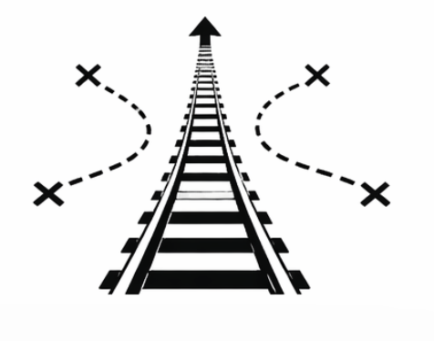

# AgentRail

<p align="center">
  
</p>

A Rust workflow CLI for keeping AI agents on track across fresh contexts.

AgentRail solves a specific engineering pain point: **AI coding agents lose operational knowledge between contexts.** The agent knows the goal but forgets procedural details -- which API to call, which flags to pass, which files to reference, and how to validate the output. AgentRail provides structured handoffs, deterministic step execution, and in-context reinforcement learning (ICRL) so agents succeed on the first attempt instead of improvising and failing 25% of the time.

## The Problem

When working with AI coding agents on multi-step projects:

- **Context truncation** causes agents to lose procedural details mid-session
- **Tool ambiguity** leads agents to pick the wrong approach for known tasks
- **Execution drift** means agents creatively rewrite procedures that should be deterministic
- **Session boundaries** force you to re-explain everything when a new context starts

The result: you intervene manually on roughly 1 in 4 steps, re-explaining what the agent already figured out in a previous session.

## How AgentRail Fixes This

AgentRail maintains a **saga** -- a persistent, append-only record of a multi-step workflow. Each saga tracks steps with typed roles, enabling an orchestration loop:

1. **Meta steps** prepare structured handoff packets with objectives, procedures, success patterns, and failure modes
2. **Production steps** execute semantic work guided by those packets
3. **Deterministic steps** run fully-specified jobs (TTS, ffmpeg, video concat) without agent involvement
4. **Validation steps** check outputs against acceptance contracts

Every step records its trajectory (state, action, result, reward). On the next run of a similar task, AgentRail retrieves successful trajectories and injects them into the agent's context -- **in-context reinforcement learning**. The agent learns from its own past successes without any weight updates.

## Current Status

**Phases 0-5 implemented.** The full ICRL loop is functional:

- 16 CLI commands: `setup`, `init`, `add`, `status`, `next`, `begin`, `complete`, `plan`, `history`, `distill`, `run-loop`, `abort`, `archive`, `audit`, `snapshot`, `gen-agents-doc`
- Maintenance mode: `agentrail add` for ad-hoc tasks, agents create steps from user messages
- XSkill dual memory: skills (strategic workflow docs) + trajectories (per-run records)
- ICRL injection: `next` shows skill procedures, failure modes, and past successful trajectories
- Trajectory recording via `complete --reward --actions --failure-mode`
- Skill distillation: `distill` generates skills from accumulated trajectories
- Domain repos: register external skill/executor/validator repos
- Shell executors and validators for deterministic step auto-execution
- Orchestrator loop: `run-loop` auto-executes deterministic steps, pauses at agent steps
- Recovery & diagnostics: `audit` compares git history to saga history and emits reconstruction commands; `snapshot` saves `.agentrail/` into the git object store as a safety net
- 75 integration and unit tests, all passing

## Quick Start

```bash
# Build and install
cargo build --release
sw-install -p .

# Bootstrap a project (creates saga + CLAUDE.md + domain registration)
cd ~/my-project
agentrail setup --name my-project \
  --plan "Build a web app with user auth" \
  --domain /path/to/agentrail-domain-coding

# Create the first step
agentrail complete --summary "Initialized" \
  --next-slug scaffold \
  --next-prompt "Set up project structure" \
  --next-role production \
  --planned "implement: Build core logic" \
  --planned "test: Write tests"

# Start Claude Code
claude "go"
```

Or use the interactive wizard:

```bash
bash /path/to/agentrail-rs/scripts/agentrail-wizard.sh
```

For maintenance mode (ongoing bug fixes, ad-hoc tasks):

```bash
# Just tell Claude what to do -- no pre-planning needed
claude "fix the login timeout bug in auth.rs"

# Or pre-load tasks and process them
agentrail add --slug fix-123 --prompt "Fix login timeout"
agentrail add --slug fix-124 --prompt "Fix mobile layout"
claude "go"   # does fix-123, stops
claude "go"   # does fix-124, stops
```

See [Getting Started](docs/getting-started.md) for the full walkthrough,
and [Maintenance Mode](docs/maintenance-mode.md) for ongoing task workflows.

## Agent Workflow

The intended workflow for an AI agent starting a fresh context:

1. Run `agentrail next` -- outputs the plan, step list, current step prompt, context files, and instructions
2. Read the prompt and any context files listed
3. Run `agentrail begin` to mark the step as in-progress
4. Do the work
5. Run `agentrail complete --summary "..." --next-slug ... --next-prompt ...` to record what was done and set up the next step

This ensures every fresh context starts with full awareness of what happened, what's next, and how to do it.

## Architecture

Cargo workspace with five crates:

```
crates/
  agentrail-core/      Domain types: saga, step, trajectory, handoff packet, job spec, errors
  agentrail-store/     File-based persistence against .agentrail/ directory
  agentrail-cli/       CLI binary (agentrail) with clap derive
  agentrail-exec/      Deterministic step executors (stub)
  agentrail-validate/  Output validators and acceptance contracts (stub)
```

Dependency flow: `cli -> store, exec, validate -> core`

All runtime data lives in `.agentrail/` (append-only):

```
.agentrail/
  saga.toml                         Saga metadata
  plan.md                           Evolving plan
  steps/NNN-slug/
    step.toml                       Step config (role, status, job spec, packet file)
    prompt.md                       Instructions for this step
    summary.md                      What was accomplished
  trajectories/{task_type}/
    run_NNN.json                    Individual ICRL trajectory records
  sessions/{session-id}.jsonl       Claude Code conversation snapshots
```

## Key Concepts

**Step Roles** define what kind of work a step involves:

| Role | Description |
|------|-------------|
| Meta | Prepares ICRL packets and handoffs for the next production step |
| Production | Executes semantic work using a prepared packet |
| Deterministic | Fully specified, no agent needed (TTS, ffmpeg, etc.) |
| Validation | Checks outputs against acceptance contracts |
| Legacy | Untyped step (backward compatibility) |

**ICRL Trajectories** are state/action/reward records stored per task type. When a task type recurs, successful trajectories are retrieved and injected into the agent's context so it can replicate what worked before.

**Handoff Packets** are structured briefings from a meta agent to a production agent containing: objective, inputs, success patterns, common failures, procedure, and output contract.

**Step Transitions** enforce a valid lifecycle: Pending -> InProgress -> Completed|Blocked.

## Roadmap

| Phase | Description |
|-------|-------------|
| 0 | Walking skeleton: working CLI with tests (done) |
| 1 | Deterministic step execution (GenerateTts, ffmpeg, probe, concat) |
| 2 | Meta handoff packet generation and rendering |
| 3 | Trajectory retrieval and ICRL injection into prompts |
| 4 | Hybrid orchestrator loop with auto-advance and escalation |

## Lineage

Evolved from [avoid-compaction](https://github.com/softwarewrighter/avoid-compaction), a saga-based context checkpoint tool. Core patterns (saga/step model, session snapshots, TOML persistence) carried forward; extended with ICRL trajectory storage, step role typing, deterministic job specs, and handoff packets.

## Development

```bash
cargo test --workspace                                 # run all tests
cargo test -p agentrail-store                          # run tests for one crate
cargo test -p agentrail-store saga                     # run tests matching a pattern
cargo clippy --workspace --all-targets -- -D warnings  # lint (covers test targets too)
cargo fmt --check                                      # format check
```

Pre-commit gate (all must pass):

```bash
cargo test --workspace && \
  cargo clippy --workspace --all-targets -- -D warnings && \
  cargo fmt --check
```

`--all-targets` matters: without it, clippy skips test and example targets and test-only lints slip through.

TDD workflow: write failing test first, implement minimum logic, refactor.

## Links

- Blog: [Software Wrighter Lab](https://software-wrighter-lab.github.io/)
- Discord: [Join the community](https://discord.com/invite/Ctzk5uHggZ)
- YouTube: [Software Wrighter](https://www.youtube.com/@SoftwareWrighter)

Related post: [From avoid-compaction to AgentRail](https://software-wrighter-lab.github.io/2026/03/15/saw-reg-rs-avoid-compaction-agentrail/)

## Copyright

Copyright (c) 2026 Michael A. Wright

## License

MIT License. See [LICENSE](LICENSE) for the full text.
